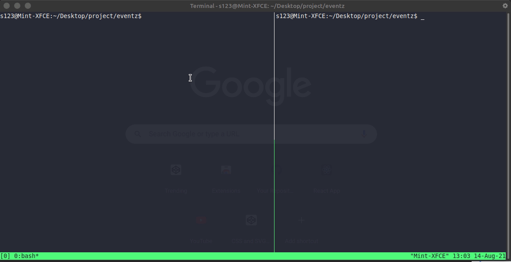

# 🚀 Eventz - professional events solution

<p>


</p>

</br>

## Overview
**Eventz** is an event creation and booking webapp that aims at solving event organization and ticketing problem related with an offline system. To understand the internals of this system , [read this](./assets/DOCUMENTATION.md).

</br>

## Installation
1. Clone this repository: 
```bash
git clone https://github.com/atTheShikhar/eventz.git
```

2. Goto the cloned repo by:
```bash
cd eventz
```

3. **Client Setup**
	1. Goto `eventz-client` directory by: 
	```bash
	cd eventz-client
	```

	2. Create `.env` and modify accordingly:
	```
	REACT_APP_BASE_URL= <Client url with port number>
	REACT_APP_RAZORPAY_KEY= <Your razorpay api key>
	```

	3. Run the following command to install the dependencies:
	```bash
	npm install
	```

4. Goto back to the previous directory by:
```bash
cd ..
```
5. **Server Setup**
	1. Goto `eventz-server` directory by: 
	```bash
	cd eventz-server
	```
	2. Install all dependencies by: 
	```bash
	npm install
	```
	3. Goto `config` folder and create a file `config.env` and set the following with your own values:
	```
	PORT=8000
	CLIENT_URL= <url of the client(react) app>
	SERVER_URL= <url of the server>
	MONGO_CONNECTION_URI= <your mongodb connection url>
	JWT_KEY= <your jwt key (something stong)>
	CLIENT_ID= <your client id (from google playground)>
	CLIENT_SECRET= <your client secret (from google playground)>
	REFRESH_TOKEN= <your refresh token (from google playground)>
	GMAIL_ID= <gmail id which will be used for sending mails>
	RAZORPAY_KEYID= <your razorpay key id>
	RAZORPAY_KEYSECRET= <your razorpay key secret>
	RAZORPAY_WEBHOOK_SECRET= <your webhook secret (optional)>
	```

	> **Database** : You can create your database using [MongoDB Atlas](https://www.mongodb.com/cloud/atlas) and generate the connection string from there. **NOTE:** You may need to put your ip address to Atlas's whitelist to be able to acess the database, Read [this](https://docs.atlas.mongodb.com/security/ip-access-list/) for more details.

	> **Mailing System** : This webapp uses **gmail** account to provide mailing system, the related variables like `CLIENT_ID`, `CLIENT_SECRET` and `REFRESH_TOKEN` can be found at you google playgrounds panel. The complete guide to generate your tokens are given on [this blog post](https://medium.com/@nickroach_50526/sending-emails-with-node-js-using-smtp-gmail-and-oauth2-316fe9c790a1)

	> **Payments System** : This system uses [Razorpay](https://razorpay.com/) payments integration to provide the payments feature. You can read their [docs](https://razorpay.com/docs/payment-gateway/server-integration/nodejs/) to understand and generate your tokens.

	> **Admin panel** : To access admin panel, manually create an `admin` collection in your MongoDB database and insert a document in the below format: 
	```json
	{
		"username": "<your admin username>",
		"password": "<your admin password>"
	}
	```

</br>

## Running

### Server
1. Goto `eventz-server` directory and run: 
```bash
npm start
```

### Client
1. Goto `eventz-client` directory and run:
```bash
npm start
```

</br>



</br>

## Demo

### User side:


### Admin panel: 

> To access the admin panel, goto `<your client url>/admin/login` to login


