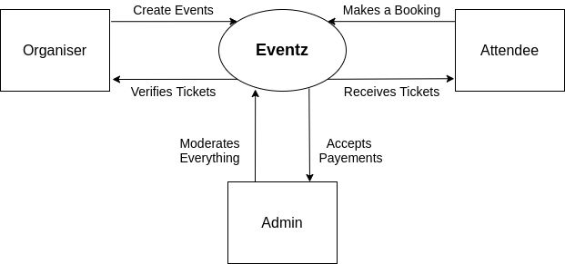
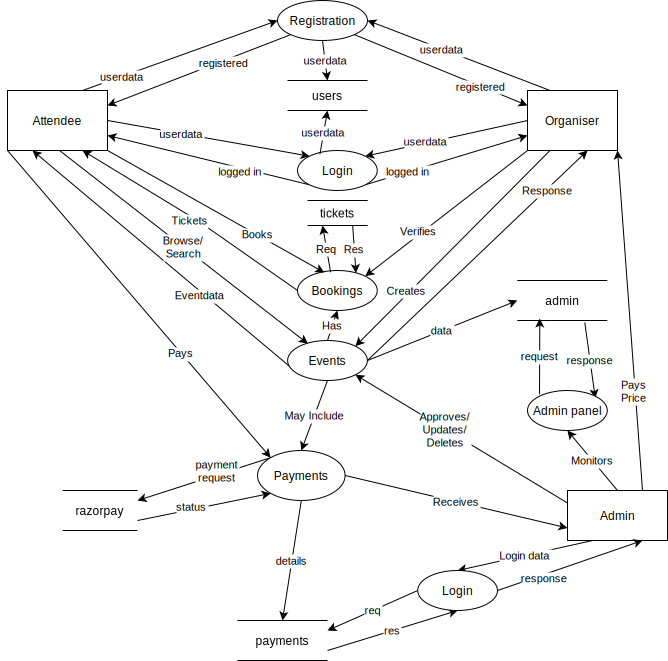
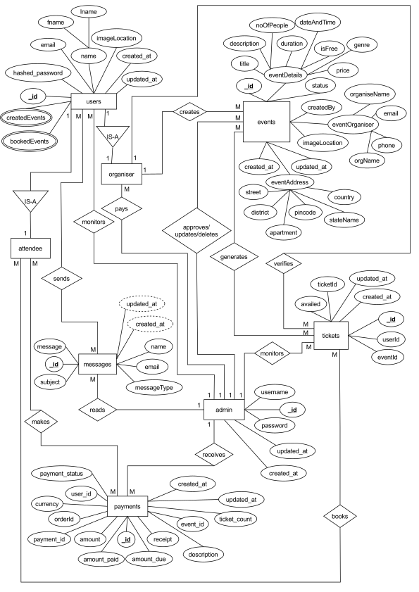

# Introduction

**Eventz** is an event creation and booking webapp, that aims at providing a free platform for event organizers and an easy and reliable site for participants to enroll in a particular event. The primary focus of this project is to serve for professional events like techfests, hackathons, seminars etc.

 

## Software Requirement Specification (SRS)

 

### Proposed Requirements: 

1. Proper user autherization and authentication must be implemented.
2. User’s emails need to be verified before the creation of the account.
3. Only registered users can create or book events.
4. Admin should be able verify the legitimacy of the event created and must give approval to paid events before they appear on the main page.
5. Any visitor can browse events but need to register to make a booking.
6. Search functionality must be provided to browse events.
7. Users should be able update their information like name and profile picture.
8. Payment integration need to be done for receiving payments for paid events.
9. Maximum 5 tickets can be booked for each event per user account.
10. Admin must be able to access, update and modify all relevant data.
11. Only authorzed person can must access admin panel.
12. Organisers must have a way to validate the tickets booked for their events.
13. Attendees must be able view and download their tickets.
14. There must be a way to contact users by the admin side and contact admin by the users side.

 

## Context Level DFD

 

 

## Level 1 DFD

 

 

## ER Diagram

 

> This project uses [MongoDB](https://www.mongodb.com/), which is non-relational database, so the concept of **Entity-Relationship** does not exists here. But still to understand the structure of the database the ER diagram is provided.

 

